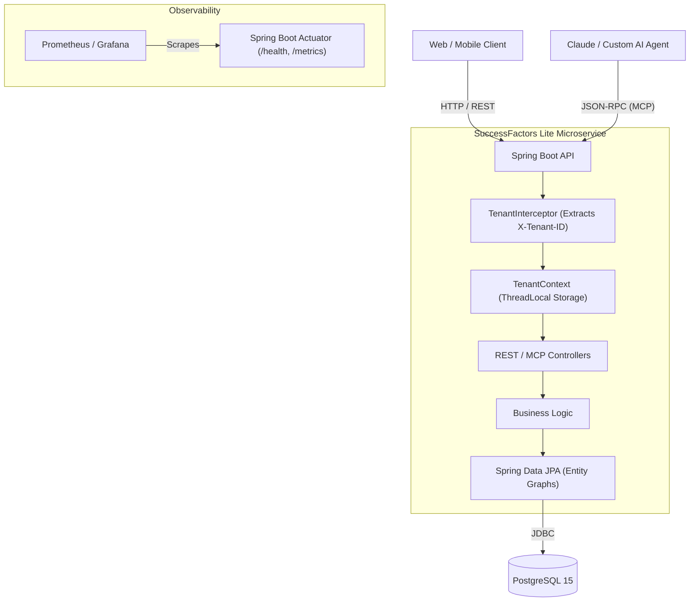

# SAP SuccessFactors Lite 🏢

> **Enterprise-grade, Multi-Tenant Spring Boot Microservice** built with Java 17, PostgreSQL, and Model Context Protocol (MCP) tooling. 

This project demonstrates core architectural patterns used in modern SaaS environments like SAP SuccessFactors, focusing on strict data isolation, observability, and AI integration.

## 🚀 Key Features

*   **Row-Level Multi-Tenancy:** Implements a shared-database, shared-schema pattern using Spring `HandlerInterceptor` and `ThreadLocal` contexts to strictly enforce tenant boundaries (e.g., preventing cross-tenant data leaks).
*   **Performance Optimized:** Solves the N+1 query problem using JPA `@EntityGraph` and optimizes read performance through PostgreSQL composite indexing.
*   **AI/LLM Integration (MCP):** Features a natively built JSON-RPC Model Context Protocol server, empowering AI Agents to securely invoke internal database tools while conforming to Tenant headers.
*   **DevOps & Observability:** Automatically deployed via GitHub Actions CI/CD pipelines. Features a Multi-Stage Dockerfile tuned with specific JVM Garbage Collection flags (`-XX:+UseG1GC`) and Spring Boot Actuator Kubernetes Readiness probes.

---

## 🏗️ System Architecture



## 🛠️ Tech Stack
*   **Backend:** Java 17, Spring Boot 3.2, Spring Data JPA, Hibernate
*   **Database:** PostgreSQL 15, Flyway (Schema Migrations), HikariCP
*   **Infrastructure:** Docker, Docker Compose, GitHub Actions
*   **Quality:** JUnit 5, Mockito, JaCoCo

---

## 💻 Local Development

Run the entire platform instantly using Docker Compose:

```bash
# Start both the Database and API server
docker compose up --build -d
```

### Try the AI/MCP Endpoint
Simulate an AI Agent retrieving an employee summary securely for a specific company:

```bash
curl -X POST http://localhost:8080/mcp/rpc \
  -H "Content-Type: application/json" \
  -H "X-Tenant-ID: acme-corp" \
  -d '{"jsonrpc": "2.0", "id": 1, "method": "tools/call", "params": {"name": "get_employee_summary", "arguments": {"employee_id": 1}}}'
```
